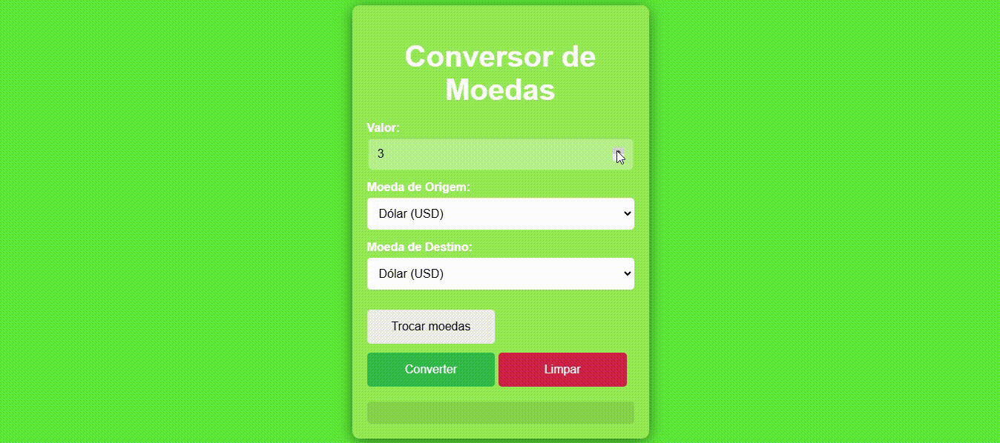
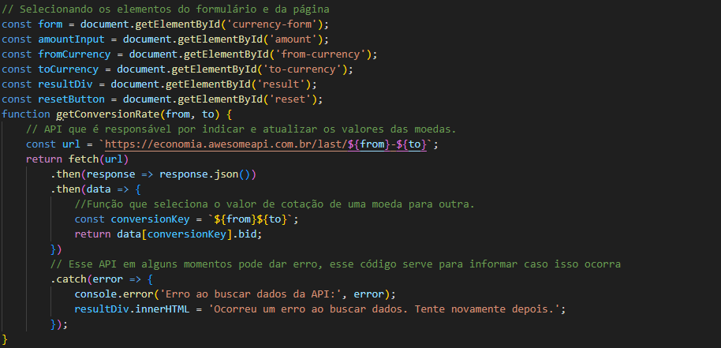
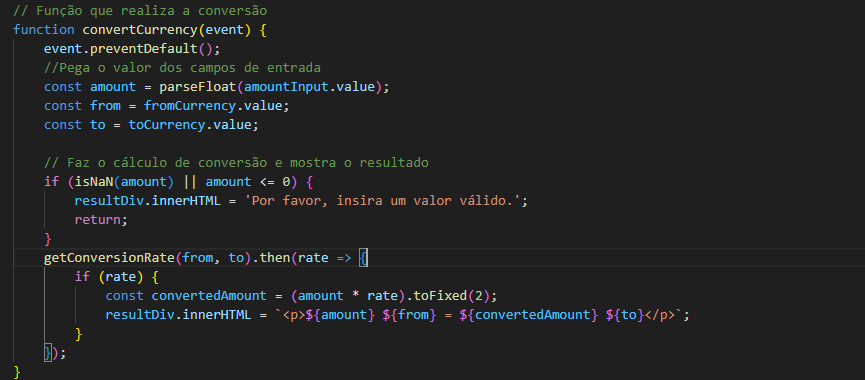
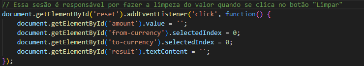
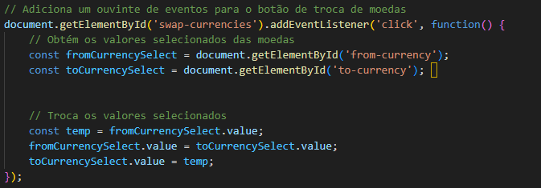

# Conversos de moedas com API
O projeto tem a função de treinar javaScript e API, fazendo um site que fará com que você digite um valor e ele ira dar algumas moedas para selecionar, em 2 diferentees espaços, e após clicar em "Converter" ele irá dizer a diferença de valor de uma para outra. Uma breve explicação do que é API: "API significa Application Programming Interface (Interface de Programação de Aplicação). No contexto de APIs, a palavra Aplicação refere-se a qualquer software com uma função distinta. A interface pode ser pensada como um contrato de serviço entre duas aplicações.". Foi feito durante as aulas de Programação Web 1 sobre a supervisão do professor Leonardo Santiago Sidon da Rocha.

## Função
O projeto possui uma interface simples, porém funcional e intuitiva. No projeto é possível ver uma caixa aonde você pode digitar um valor númerico, ou apenas selecionar um com os botões ao lado. Mais abaixo á um caixa aonde você pode selecionar um tipo de moeda, e um pouco abaixo pode selecionar também as mesmas moedas. Abaixo dessas caixas possui 3 botões, um escrito "Trocar moedas" aonde caso você clique, ele inverte as moedas selecionadas, o botão "Apagar" que ira apagar o número digitado e por último o botão "Converter", que irá dizer a diferença de valores entre as duas moedas selecionadas.

## Elementos e API

Aqui foi utilizado o API do site "Awesome API", que tem o link que é responsável por fazer as cotações de uma moeda para outra em tempo real, para ser mais exato, a atualização dos valores ocorrem a cada 30 segundos.

* const:Aqui são utilizadas diversas "Const" diferentes, cada uma tendo seu proposito para uma parte do código, como por exemplo a const "resetButton" que terá a função de mais para o fim do código de ser um identificador para o código. Porém aqui é importante citar em específico a "const conversionKey" que será a responsável por pegar os valores das moedas e converter elas.
* .then(): O método retorna uma Promise. Possui dois argumentos, ambos são "call back functions", sendo uma para o sucesso e outra para o fracasso da promessa.
 
Fonte: https://www.investopedia.com/terms/c/constantcurrencies.asp#:~:text=Constant%20currencies%20are%20exchange%20rates,with%20optional%2C%20constant%20currency%20numbers.
 
https://docs.awesomeapi.com.br/api-de-moedas
 
https://developer.mozilla.org/pt-BR/docs/Web/JavaScript/Reference/Global_Objects/Promise/then

## Conversão e resultado

Aqui é utilizado uma sequência de "Const" e também uma importância função "getConversionRate" outros códigos que como resultado irão fazer a conversão de uma moeda da forma correta e esperada. E no final do código é possível ver uma parte que tem a função de realizar a ação da conversão e mostra lá.
* Isnan: A função isNaN() determina se o valor é NaN ou não. Tenha cuidado, o cast em isNaN tem regras para serem observadas. Você pode ficar interessado no Number.isNaN() que foi definido no ECMAScript 6 ou você pode usar typeof para determinar se o valor é Not-A-Number, NaN.
* De resto será utilizado funções que farão a conversão 

 
Fonte: https://developer.mozilla.org/pt-BR/docs/Web/JavaScript/Reference/Global_Objects/isNaN

## Limpar formulário

Aqui é usado um código simples que de forma simplificada quando você clica no botão de "Limpar" ele reconhece que tem que limpar as caixas que foi comandado no código.

## Trocar valores.

Aqui é possível ver a parte do código para o botão de "Trocar moedas". E de forma simples esse código tem a função de quando clicar no botão, os dois valores serão invertidos.

## Fontes
Fonte:https://developer.mozilla.org/pt-BR/docs/Web/API/Document/getElementById
 
https://developer.mozilla.org/pt-BR/docs/Web/API/EventTarget/addEventListener
 
https://developer.mozilla.org/pt-BR/docs/Web/JavaScript/Reference/Statements/const
 

## ESSE PROJETO MESMO
https://docs.awesomeapi.com.br/api-de-moedas
 
https://www.investopedia.com/terms/c/constantcurrencies.asp#:~:text=Constant%20currencies%20are%20exchange%20rates,with%20optional%2C%20constant%20currency%20numbers.
 
https://aws.amazon.com/pt/what-is/api/#:~:text=API%20significa%20Application%20Programming%20Interface,de%20servi%C3%A7o%20entre%20duas%20aplica%C3%A7%C3%B5es.
 
https://developer.mozilla.org/pt-BR/docs/Web/JavaScript/Reference/Global_Objects/Promise/then
 

## Tecnologias utilizadas 

* ``HTML 5``
* ``CSS 3``
* ``Java Script``
* ``Github``
* ``VsCode``
* ``Microsoft Teams``
* ``Google``
## Autor
Kleyverson de Oliveira Sampaio